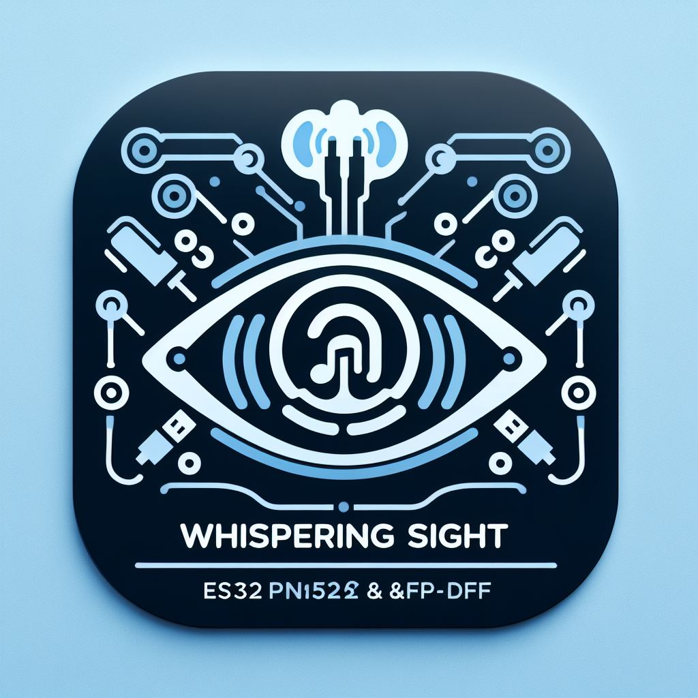

# Project : Whispering Sight

  
Whispering Sight

  

  

  

---
## Playing Card Recognition for the Visually Impaired

## Project Idea
Create a web application that enables blind individuals to enjoy playing cards with others, fostering inclusivity and overcoming disability-related limitations.

## Implementation Concept

### Communication Methods
- Audio feedback (recommended)
- Haptic feedback (not recommended)

### Components
- **Web Application (Card Recognition Software):** This software interfaces with RFID modules on the player's table and sends requests based on the detected card IDs.
- **Server:**
  - API for handling requests and responses.
- **Database:** Contains card information.
- **Mobile Device:** This Device allows users to manage requested data and signals from the Server.

### Hardware Options
1. Option:
   - Camera:
        - Image Recognition
        - Video Recognition

2. Option:
    - RFID:
        - RFID Modules (e.g., RC522,PN532)
        - RFID strips
        - 3D-printed table (for card recognition using RFID)

---

# Customer Meeting Summary

---

# Context of Use Description - ISO 25063:2014

## Context of Use Element

**Details**

- **System, Product or Service:** An inclusive technology for playing physical card games, designed to ensure that the user is able to play various card games with ease and enjoy an inclusive experience.

- **User Group(s):** In this case, there may be two user groups involved:
  - The client with specified vision impairment.
  - The other players playing with the client.

- **Demographic Data:** The current user has faced visual impairment since childhood, with the condition starting between the ages of six and eight years old. They have also experienced a progressive deterioration in their vision, beginning with difficulty seeing in low-light conditions and ultimately leading to the need for a magnifying glass, large fonts on digital platforms, and other adaptive tools. The user knows how to do 10-finger typing on the PC, how to use the PC without a mouse, and has learned braille. The user also enjoys playing all kinds of board games and card games.

- **Goals:** The goal is to enable a user with a visual impairment, specifically retinal degeneration leading to 30% clarity and tunnel vision, to play various card games with ease. The other players at the table should be a part of the solution, and their experience must be enjoyable as well.

- **Assumed Tasks to be supported:**
  - Accessing the digital platform developed for fluent card gameplay.
  - Selecting and participating in various card games, both solo and multiplayer.
  - Handling cards physically with ease and accuracy.
  - Adjusting interface settings for accessibility, such as font size and voice output.
  - Maintaining consistent internet access for online card game sessions.

- **Assumed Environment:**
  - Users may access the digital card game platform in various environments, wherever they are playing.
  - The environment may have varying lighting conditions.
  - The gameplay would ideally happen on a table with players on all sides of the table.
  - The environment may or may not have a stable internet connection.

- **Assumed equipment for task completion:**
  - A mobile phone with a screen reader for interaction with the technology.
  - Earphones to ensure that the audio is only heard by the required user.
  - An internet connection to access the digital platform.
  - A space for physical card handling like a room or a table.

**Tools required to build the accessible technology:**

---

# User Needs Report - ISO 25064:2014

## User Needs Element

**Details**

- **Goal:** The goal is to enable a user with a visual impairment, specifically retinal degeneration leading to 30% clarity and tunnel vision, to play various card games with ease.

- **Task:** The user wishes to engage in card games, including but not limited to poker cards, Uno, and Settlers of Catan. The user is interested in card games and is looking for a solution that accommodates their disability, making card game participation accessible and enjoyable.

- **User Group(s):** In this case, there may be two user groups involved:
  - The client with specified vision impairment.
  - The other players playing with the client.

- **Preconditions:**
  - The user has a vision impairment.
  - The user uses several applications on his iPhone using a screen reader option.
  - The user enjoys playing card games.

- **Subgoals:** The other players at the table should be a part of the solution, and their experience must be enjoyable as well.

- **Requirements:**
  - The user needs an accessible technology for playing card games with a group of people who may or may not have any disabilities.
  - The technology should support various card games.
  - The technology may include voice output supported by the client's iPhone.
  - The user may need consistent internet access to use the existing applications on his phone. The solution should consider potential challenges the user may face in maintaining internet connectivity.
  - The user interface of the technology should be optimized for users with vision impairment.
  - The user should be able to play card games with others, possibly with assistance or adaptations to accommodate the user's disability.
  - The platform should offer support and resources to help the user learn and use the system effectively.

        
